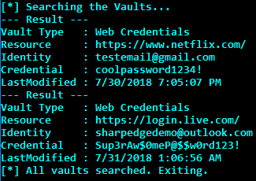

# SharpEdge

SharpEdge is a C# implementation of [@mattifestation's](https://twitter.com/mattifestation) script [Get-VaultCredential](https://github.com/PowerShellMafia/PowerSploit/blob/master/Exfiltration/Get-VaultCredential.ps1). The aim of this is to ride the wave of evasive .NET binaries that move red teams away from PowerShell and into a space that has less introspection.

SharpEdge is written in .NET 2.0 CLR and dumps Internet Explorer/Microsoft Edge credentials.

## Compilation

To compile, simply load the solution into Visual Studio and build the project.

## Usage

.\SharpEdge.exe

## Example Output

## Your Code Sucks!

You don't have to tell me; submit a PR and _help me_!
